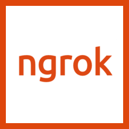
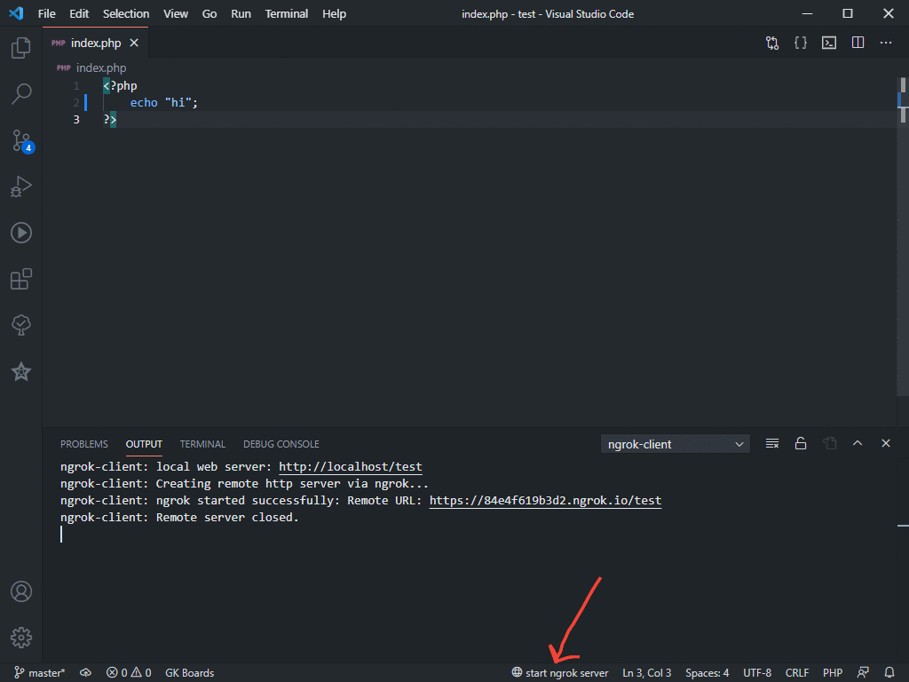

 
  

<h1 align="center">Vscode Ngrok Http Client</h1>
 

## About
Create a web server that allow your local http server to be accessible remotely on VS Code.

## Features

* Local url will be generated from output window that will be shown automatically.
* Remote url will be generated from output window that will be shown automatically.
> You must open a folder from VS Code for starting a web server.
 
> You must have http server installed (xampp or apache etc..). 

## Available at
[Marketplace](https://marketplace.visualstudio.com/items?itemName=KaramAlhamoud.vscode-ngrok-client-http)

## Screenshot

